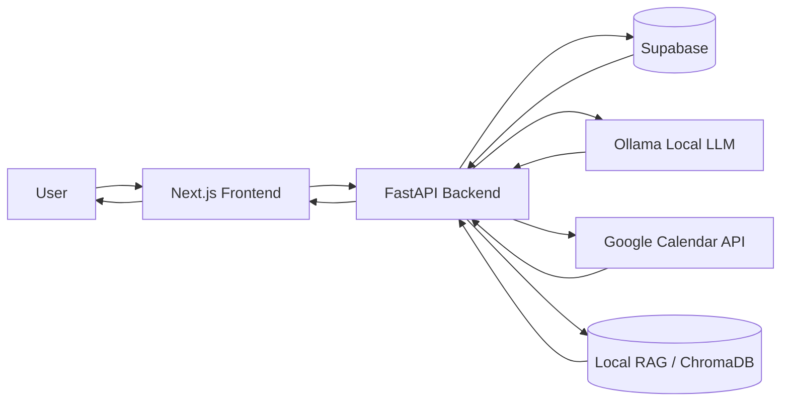

# CSIS SmartAssist

An AI-first assistant for the CSIS ecosystem at BITS Pilani Goa that answers department-specific queries, suggests calendar slots, and converts intent into booking workflows with role-aware approvals.

---

## Video Demo

Watch the project demo here: https://drive.google.com/drive/folders/1Hh8xhaBrTDlusdGldsdM1FvDNQc6UA99?usp=sharing

## Live Deployment

Try the deployed app here: https://csis-smart-assist.vercel.app/

---

## Why this project exists

Typical campus help flows are fragmented:

- information is spread across docs/forms/announcements,
- users ask in chat but still complete processes manually,
- admins lose time handling repetitive coordination.

**CSIS SmartAssist** closes that loop in one interface:

1. Ask a question in natural language.
2. Get contextual answers (with supporting references where available).
3. Move directly into booking and approval workflows.

---

## What makes us stand out (vs typical hackathon teams)

Most teams stop at a demo chatbot. This project is intentionally **workflow-complete**:

- **From Q&A to action:** the assistant does not just answer; it can trigger booking request flows.
- **Role-aware governance:** users/admins are modeled through backend role assignment and review actions.
- **Memory + context fusion:** combines conversation continuity with document retrieval.
- **Calendar-native assistant behavior:** checks slot availability and proposes nearby alternatives.
- **Operationally realistic architecture:** Next.js frontend + FastAPI backend + Supabase persistence + deployable `render.yaml`.
- **Designed for real institutional usage:** CSIS-focused intents, booking fields, and approval lifecycle.

---

## Core features

### 1) Smart Chat Assistant

- Local LLM-powered conversational responses (via Ollama).
- Intent routing between:
  - **`info_query`** (knowledge/help responses)
  - **`calendar_query`** (availability and slot workflows)
- Session-based chat history persistence.

### 2) Retrieval-Augmented Responses

- Local knowledge ingestion from `backend/data/` into RAG tables.
- Searchable chunk storage and retrieval APIs.
- Structured source metadata returned from chat responses.

### 3) Booking Lifecycle

- Request creation with location/date/time/purpose/remarks.
- Admin decision endpoint (accept/decline) with optional reviewer remarks.
- Accepted requests can generate Google Calendar events.
- Email notification hooks for request creation and decision updates.

### 4) Calendar Intelligence

- Slot availability check by start time + duration.
- Nearby free slot discovery within configurable time windows.
- Assistant response includes actionable next step (“create booking request?”).

### 5) Identity & Roles

- Google sign-in on frontend (NextAuth).
- Backend session sync to create/apply user roles.
- Seed-based admin bootstrap through environment config.

---

## Project specificity (CSIS context)

This is not a generic AI wrapper. The implementation is tuned for CSIS workflows:

- room/lab booking intent extraction,
- purpose-driven request payloads,
- admin moderation flow for resource access,
- campus timezone-aware scheduling (`Asia/Kolkata`).

---

## Design system (frontend)

The UI follows a practical, high-density, dark-first system documented in `frontend/DESIGN.md`:

- **Visual style:** utilitarian, low-noise, high-contrast structure.
- **Typography pairing:** sans for prose + mono for data/metadata.
- **Interaction focus:** chat-first with inline booking actions, not form-heavy page switching.
- **Information architecture:** history + active chat + role-aware admin controls.

---

## Accessibility commitments

Current accessibility-minded choices:

- semantic HTML via Next.js/React defaults,
- keyboard-friendly form controls and buttons,
- high-contrast dark palette and clear content separation,
- plain-language conversational UX.

Planned hardening:

- automated audits with Lighthouse/axe,
- full keyboard traversal checks,
- explicit ARIA validation for dynamic chat regions,
- WCAG 2.2 AA verification pass before production rollout.

---

## Tech architecture

### Stack at a glance

**Frontend (`frontend/`)**

- Next.js 16, React 19, TypeScript
- NextAuth (Google provider)
- Tailwind CSS

**Backend (`backend/`)**

- FastAPI
- Supabase (users, roles, bookings, chat history, RAG metadata)
- Ollama (local LLM) for generation
- ChromaDB + Sentence Transformers for local retrieval path
- Google Calendar API integration

**Data layer**

- Supabase schema in `supabase/schema.sql`
- RAG local files in `backend/data/`

### Request flow (simplified)



### Active backend entrypoint

- Deployment uses `backend/main.py` (`uvicorn main:app`).
- `backend/Chatbot/` contains earlier/legacy modules still present in repo; current Render config points to `main.py`.

---

## Repository layout

```text
csis-smart-assist/
├── backend/               # FastAPI API + integrations + ingestion
├── frontend/              # Next.js UI + NextAuth
├── supabase/schema.sql    # DB schema
├── render.yaml            # Render backend deployment blueprint
└── README.md              # You are here
```

---

## Quick start (local, easiest path)

## 0) Prerequisites

- Python 3.11+
- Node.js 20+
- npm
- Supabase project
- Google OAuth credentials
- Ollama (for local LLM)

## 1) Clone and enter repo

```bash
git clone https://github.com/IamShauryaSuman/csis-smart-assist.git
cd csis-smart-assist
```

## 2) Backend setup

```bash
cd backend
python3 -m venv .venv
source .venv/bin/activate
pip install -r requirements.txt
```

Optional RAG extras (if separated in your environment):

```bash
pip install -r requirements-rag.txt
```

Create env file:

```bash
cp .env.example .env
```

Set at least these keys in `backend/.env`:

- `SUPABASE_URL`
- `SUPABASE_SECRET_KEY` (preferred)
- `FRONTEND_ORIGIN` (e.g. `http://localhost:3000`)
- `OLLAMA_BASE_URL` (e.g. `http://localhost:11434`)
- `OLLAMA_MODEL` (e.g. `gemma2:2b`)
- `EMBEDDING_MODEL` (e.g. `sentence-transformers/all-MiniLM-L6-v2`)
- `GOOGLE_CALENDAR_ID`
- `GOOGLE_REFRESH_TOKEN`
- `GOOGLE_CLIENT_ID`
- `GOOGLE_CLIENT_SECRET`
- `GOOGLE_TOKEN_PATH` (optional fallback to token JSON)
- `GOOGLE_SENDER_EMAIL` (if using notifications)

Use the same `GOOGLE_CLIENT_ID` and `GOOGLE_CLIENT_SECRET` in both `frontend/.env.local` and `backend/.env` so one Google Cloud app handles sign-in and all Google API calls.

Apply DB schema by running `supabase/schema.sql` in your Supabase SQL editor.

Run backend:

```bash
uvicorn main:app --host 127.0.0.1 --port 8000 --reload
```

Backend URLs:

- API: `http://127.0.0.1:8000`
- OpenAPI docs: `http://127.0.0.1:8000/docs`

## 3) Frontend setup

In a new terminal:

```bash
cd frontend
npm install
```

Create `frontend/.env.local`:

```dotenv
NEXT_PUBLIC_BACKEND_URL=http://localhost:8000
GOOGLE_CLIENT_ID=...
GOOGLE_CLIENT_SECRET=...
NEXTAUTH_SECRET=...
NEXTAUTH_URL=http://localhost:3000
```

Run frontend:

```bash
npm run dev
```

Open `http://localhost:3000`.

---

## Environment variable reference

### Backend (`backend/.env`)

| Variable                     | Required     | Purpose                                |
| ---------------------------- | ------------ | -------------------------------------- |
| `SUPABASE_URL`               | Yes          | Supabase project URL                   |
| `SUPABASE_SECRET_KEY`        | Yes\*        | Server-side Supabase auth key          |
| `SUPABASE_SERVICE_ROLE_KEY`  | Optional     | Legacy fallback key                    |
| `VECTOR_DIMENSIONS`          | Optional     | Embedding vector size (default `1536`) |
| `FRONTEND_ORIGIN`            | Yes          | CORS origin for frontend               |
| `OLLAMA_BASE_URL`           | Yes          | Ollama server URL (default: http://localhost:11434) |
| `OLLAMA_MODEL`             | Yes          | Ollama model name (default: gemma2:2b) |
| `EMBEDDING_MODEL`          | Yes          | Sentence transformer model (default: all-MiniLM-L6-v2) |
| `GOOGLE_CALENDAR_ID`         | For calendar | Target calendar for events/checks      |
| `GOOGLE_DRIVE_FOLDER_ID`     | Optional     | Default Drive folder for RAG ingest    |
| `GOOGLE_REFRESH_TOKEN`       | For Google   | Shared OAuth refresh token             |
| `GOOGLE_CLIENT_ID`           | For Google   | Shared OAuth client id                 |
| `GOOGLE_CLIENT_SECRET`       | For Google   | Shared OAuth client secret             |
| `GOOGLE_TOKEN_PATH`          | Optional     | OAuth token JSON path fallback         |
| `GOOGLE_SENDER_EMAIL`        | Optional     | Gmail API sender address               |
| `ADMIN_SEED_EMAILS`          | Optional     | Comma-separated admin bootstrap emails |
| `RAG_LOCAL_DATA_DIR`         | Optional     | Local docs folder                      |
| `RAG_AUTO_INGEST_LOCAL_DATA` | Optional     | Auto-ingest at startup                 |
| `RAG_AUTO_INGEST_DRIVE_DATA` | Optional     | Auto-ingest Google Drive at startup    |

\* `SUPABASE_SECRET_KEY` preferred; fallback options are supported.

### Frontend (`frontend/.env.local`)

| Variable                  | Required | Purpose                    |
| ------------------------- | -------- | -------------------------- |
| `NEXT_PUBLIC_BACKEND_URL` | Yes      | FastAPI base URL           |
| `GOOGLE_CLIENT_ID`        | Yes      | NextAuth Google provider   |
| `GOOGLE_CLIENT_SECRET`    | Yes      | NextAuth Google provider   |
| `NEXTAUTH_SECRET`         | Yes      | Session/JWT signing secret |
| `NEXTAUTH_URL`            | Yes      | Public frontend URL        |

---

## API surface (current backend)

### Chat & history

- `POST /chat`
- `GET /chat/sessions?email=...`
- `POST /chat/sessions`
- `GET /chat/sessions/{session_id}/messages`
- `POST /chat/sessions/{session_id}/messages`

### Booking & approvals

- `POST /booking-requests`
- `GET /booking-requests`
- `PATCH /booking-requests/{request_id}/decision`

### Calendar

- `POST /calendar/availability`
- `POST /calendar/nearby-slots`

### Identity & roles

- `POST /users/sync`
- `POST /users/sync-session`
- `POST /users/{user_id}/roles`
- `GET /users/{user_id}/roles`
- `GET /users/roles/by-email`

### RAG

- `POST /rag/documents`
- `POST /rag/chunks`
- `POST /rag/chunks/search`
- `POST /rag/ingest-local`
- `POST /rag/ingest-drive`

---

## Deployment

### Backend on Render

This repo already ships `render.yaml` configured to:

- root: `backend/`
- build: `pip install -r requirements.txt`
- start: `uvicorn main:app --host 0.0.0.0 --port $PORT`

### Frontend on Vercel

- Import repo and set root directory to `frontend`.
- Add frontend env vars.
- Set backend `FRONTEND_ORIGIN` to your Vercel URL.

---

## Quality checks

Frontend:

```bash
cd frontend
npm run lint
npm run build
```

Backend quick health check after startup:

```bash
curl http://127.0.0.1:8000/health
```

---

## Known constraints

- Calendar flow requires valid Google Calendar credentials/token file.
- LLM behavior degrades if Ollama is not running or if the model is unavailable.
- Parts of `backend/Chatbot/` are legacy and not the primary runtime path.

---

## Team intent

This project is built to prove that campus assistants should be:

- **context-aware**,
- **actionable**,
- **admin-safe**, and
- **deployable under hackathon constraints**.

If you’re evaluating this for extension, the fastest next improvements are:

1. migrate all retrieval logic to a single store strategy,
2. expand admin audit trails,
3. complete formal accessibility and security audits.
